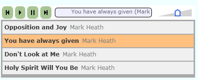

## Overview
Silverlight Audio Player is a simple audio player that can be used for playing back one or more audio files. It currently supports two styles of player. The first plays a single file and is based on the visual design of the [WordPress audio player](http://wpaudioplayer.com/). The second allows you to play multiple files.

## Installation
You need the AudioPlayer.xap file, and optionally an XML playlist file. Once you have those, you can
load the Silverlight application in the same way you would any other. Remember to set up the size appropriately,
and pass in the MP3 file Url or Playlist Url in the Initparams (see below).  By convention, Visual Studio likes
XAP files to be stored in a ClientBin folder. You do not need to do this, and if you don't, you will need to adjust the
relative paths from the examples shown below (i.e. no need for ..\ on your Urls).

## Using the Single Player
To use the single player, simply pass init params following the to your silverlight object. The single player should be sized 295 pixels wide and 30 pixels high.

**InitParams:** _Url=http://www.mydomain.com/audio/song-1.mp3,Artist=Artist Name,Title=Song title_


## Using the Multiple Player
The multi-player is still a work in progress. To launch the player with multiple files, you need to point it at a playlist. A playlist is
an XML file containing the Url, Artist and Title for each track you wish to play.

```xml
<?xml version="1.0" encoding="utf-8" ?>
<playlist>
  <audiofile url="http://www.wordandspirit.co.uk/blog/audio/01-opposition-and-joy.mp3" title="Opposition and Joy" artist="Mark Heath" />
  <audiofile url="http://www.wordandspirit.co.uk/blog/audio/you-have-always-given.mp3" title="You have always given" artist="Mark Heath" />
  <audiofile url="http://www.wordandspirit.co.uk/blog/audio/dont-look-at-me.mp3" title="Don't Look at Me" artist="Mark Heath" />
  <audiofile url="http://www.wordandspirit.co.uk/blog/audio/holy-spirit-will-you-be.mp3" title="Holy Spirit Will You Be" artist="Mark Heath" />
</playlist>
```

**InitParams:** _Playlist=../MyPlaylist.xml_


## Project News
**1 Apr 2008**
The Single and Multi player controls are basically working now, but need a little bit of visual tidy-up before we make our first beta release. Also, the project structure will be simplified, as we do not really need a separate controls DLL.

**17 May 2008**
Due to a known bug in Silverlight 2 beta 1 to do with customising vertical scrollbars, I am waiting for the next beta release before doing too much more work on this.

**8 Jun 2008**
Updated to work with Silverlight 2 beta 2
Work will focus on making the simple player and multi player look nice, at which point we will be ready for a first beta release

**14 Oct 2008**
Updated to work with Silverlight 2 RTW

**6 Jan 2009**
Have been slowly improving the visual appearance of both players, working towards a first release

**14 Sep 2009**
Finally a first beta release!

**30 Oct 2009**
Volume control for the simple audio player
